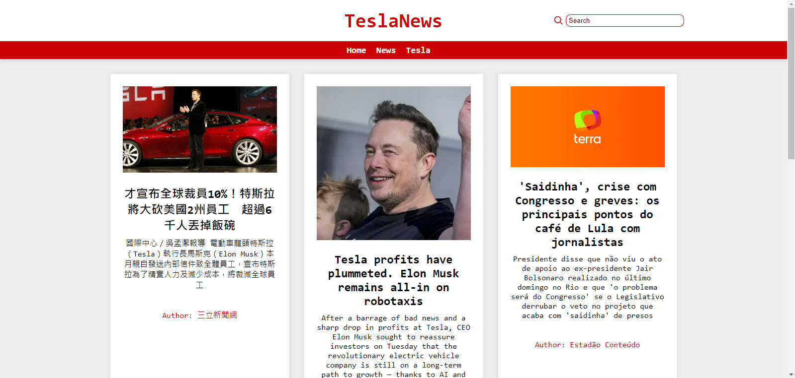

# Tesla News



## Descrição

O Tesla News é um aplicativo web que fornece notícias atualizadas sobre a empresa Tesla. Ele utiliza a API de notícias para recuperar os últimos artigos relacionados à Tesla e os exibe de forma organizada para os usuários.

## Funcionalidades

- **Visualização de notícias**: Os usuários podem visualizar os últimos artigos de notícias sobre a Tesla.
- **Atualização automática**: As notícias são atualizadas automaticamente conforme novos artigos são publicados.
- **Pesquisa avançada**: Os usuários podem pesquisar por palavras-chave específicas para encontrar notícias sobre tópicos de seu interesse.
- **Compartilhamento fácil**: Os usuários podem compartilhar os artigos de notícias através de redes sociais ou copiar o link para compartilhamento.

## Acesso ao Aplicativo

Você pode acessar o aplicativo [aqui](https://tesla-news-app.netlify.app).

## Tecnologias Utilizadas

- React.js: Biblioteca JavaScript para construção da interface do usuário.
- React Router: Para navegação entre as páginas do aplicativo.
- Axios: Para fazer requisições HTTP para a API de notícias.
- CSS: Estilização dos componentes e páginas do aplicativo.

## Instalação

Para executar o projeto localmente, siga estas etapas:

1. Clone o repositório para o seu computador:

```bash
git clone https://github.com/Marcelo-Soares-codes/CineQuiz.git
```

2. Instale as dependências do projeto:

```bash
cd tesla-news
npm install
```

3. Inicie o servidor de desenvolvimento:

```bash
npm start
```

## Contribuição

Contribuições são bem-vindas! Se você deseja melhorar o Spelet, sinta-se à vontade para abrir uma issue ou enviar um pull request.
